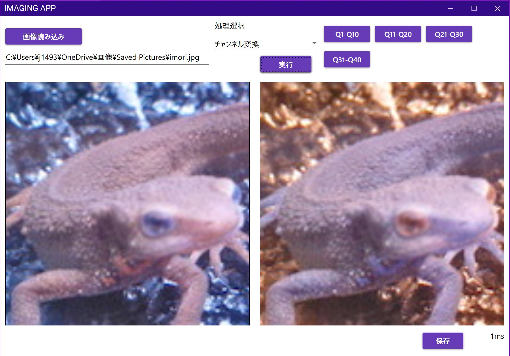
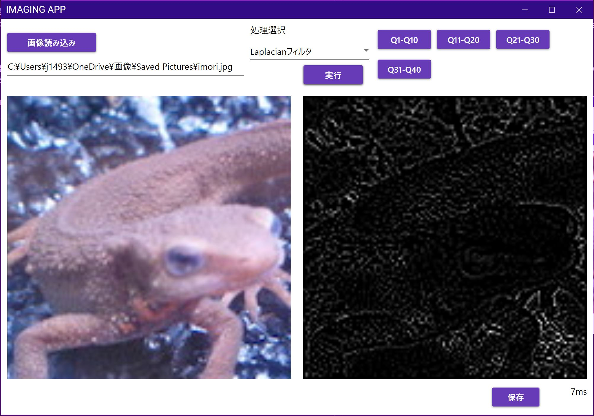

# 画像処理100本ノック（C#版）

- GitHubで紹介されている[画像処理100本ノック](https://github.com/yoyoyo-yo/Gasyori100knock)をC#で行ってみました。

- OpenCVなどの画像処理ライブラリは使用しておりません。アンセーフコードを許可し、ポインタを利用することで処理の高速化を実現しています。

- Q35まで回答済み（2020/07/06現在）

- 必要な画像を読み込み、処理内容をコンボボックスから選択するだけで、処理後の結果画像を確認することができます。

  
  

  